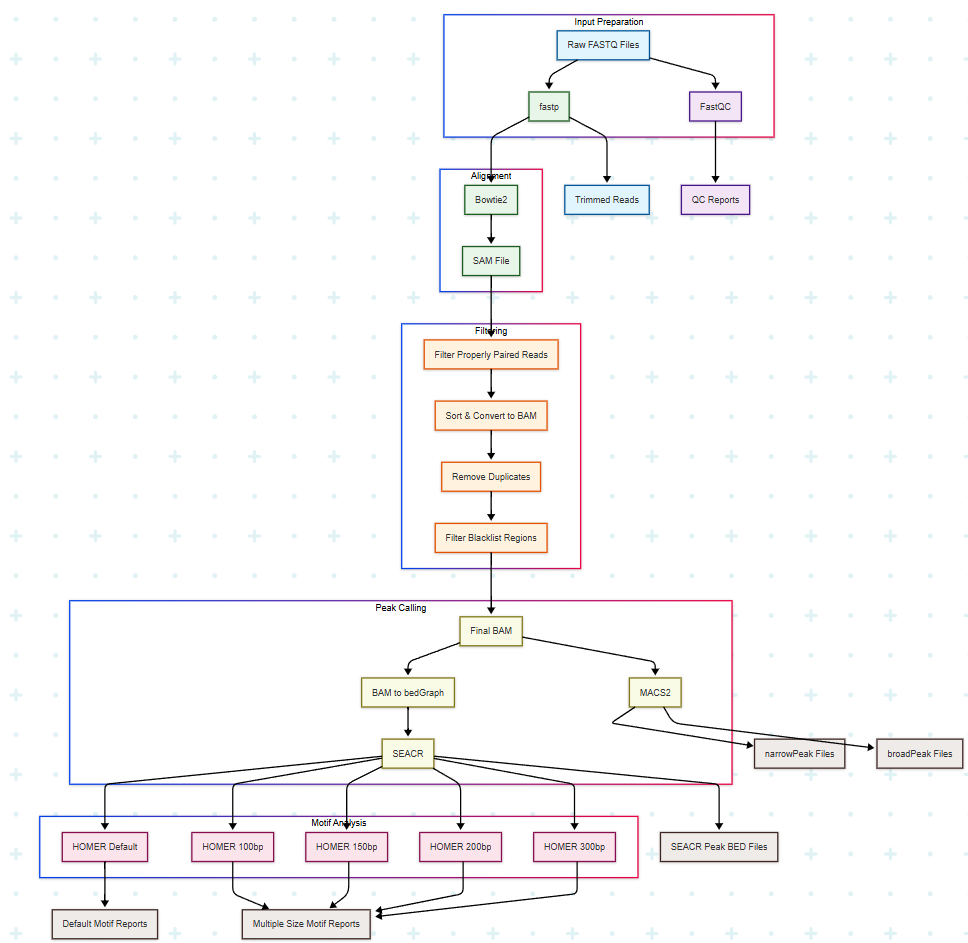

# SnakeMake CutAndRun-seq Pipeline

## Overview

This Snakefile implements a complete CutAndRun-seq analysis pipeline using Snakemake. Cut&Run-seq (Cleavage Under Targets and Release Using Nuclease) is a technique used to map protein-DNA interactions and histone modifications with higher resolution and lower background compared to traditional ChIP-seq methods. We usually used IgG as a control (we set IgG as input control in sample.csv data sheet).


## Results Visualization




## Features

- Quality control of raw sequencing data with FastQC
- Read trimming and filtering with fastp
- Alignment to reference genome with Bowtie2 with **--dovetail**
- Filtering for properly paired and uniquely mapped reads (both reads should be uniquely mapped) 
- Duplicate removal with Picard
- Blacklist filtering to remove artifact regions (filtering based on fragments and keeping paired reads)
- Peak calling with both MACS2 and SEACR (SEACR exclusively developed for Cut&Run Seq; We used peaks called by SEACR for downstream homer motif analysis)
- Generation of bedGraph coverage files
- Motif analysis with HOMER at multiple peak sizes

## Requirements

### Tools
- Snakemake
- FastQC
- fastp
- Bowtie2
- Samtools
- Bedtools
- Picard
- MACS2
- SEACR 1.3
- HOMER2 (follow homer2 installation instructions and put it under homer2 folder)

### Input Files
- Paired-end FASTQ files for each sample
- A samples table in CSV format with sample information
- Reference genome index for Bowtie2
- Blacklist regions BED file
- Genome size file for bedGraph conversion

## Installation

1. Clone this repository:
   ```bash
   git clone https://github.com/yourusername/CutAndRun-seq_pipeline.git
   cd CutAndRun-seq_pipeline
   ```

2. Create and activate conda environments for the tools:
   ```bash
   conda env create -f envs/snakemake.yaml
   conda env create -f envs/macs2.yaml
   conda env create -f envs/bedtools.yaml
   conda env create -f envs/homer2.yaml
   ```

## Directory Structure

```
project/
├── data/                    # Input FASTQ files
│   ├── sample1_R1_001.fastq.gz
│   ├── sample1_R2_001.fastq.gz
│   └── ...
├── ref/                     # Reference files
│   ├── config.yaml          # Configuration file
│   ├── blacklist-stats-script.py
│   ├── hg38.genome
│   ├── hg38_blacklist_regions.bed
│   ├── samples.csv
│   ├── process_sam.py
│   ├── picard.jar
│   ├── UCSC/
│   ├── SEACR/               # SEACR tool directory
│   └── homer2/              # HOMER2 tool directory
├── envs/                    # Conda environment files
│   ├── snakemake.yaml                 
│   ├── macs2.yaml
│   ├── bedtools.yaml
│   └── homer2.yaml
├── logs/                    # Log files
└── results/                 # Output results
    ├── fastqc/
    ├── fastp/
    ├── aligned/
    ├── filtered/
    ├── dedup/
    ├── blacklist_filtered/
    ├── peaks/              # MACS2 peaks
    ├── seacr_peaks/        # SEACR peaks
    ├── bedgraph/
    ├── motifs/
    └── qc/
```

## Configuration

Edit the `ref/config.yaml` file to customize parameters:

```yaml
# Path to sample information table
samples_table: "samples.csv"

# Genome references
bowtie2_index: "path/to/bowtie2/index/prefix"
blacklist: "path/to/blacklist.bed"
genome_size: "path/to/genome.sizes"
```

## Sample Information

Create a CSV file with the following format:

```csv
sample_id,condition,replicate,input_control,peak_mode,notes
GSF2801-CRseq-OVCAR3-3D-IP-cJun_S4,cJUN,1,GSF2801-CRseq-OVCAR3-3D-IP-IgG_S5,narrow,3D-cJUN
GSF2801-CRseq-OVCAR3-3D-IP-IgG_S5,Igg,1,,,3D-Igg
GSF2801-CRPseq-OVCAR3-Control-IP-cJun_S1,cJUN,1,GSF2801-CRseq-OVCAR3-Control-IP-IgG_S2,narrow,Ctrl-cJUN
GSF2801-CRseq-OVCAR3-Control-IP-IgG_S2,Igg,1,,,Ctrl-Igg
```

Where:
- `sample_id`: Unique identifier for each sample
- `input_control`: Optional field specifying which sample to use as control for peak calling and left blank for IgG
- `peak_mode`: Optional field specifying "broad" or "narrow" peak calling mode (defaults to narrow)

## Usage

1. Prepare your sample CSV file with sample information
2. Place raw FASTQ files in the `data/` directory
3. Update the configuration in `ref/config.yaml`
4. Run the pipeline:
   ```bash
   snakemake --cores 24 --use-conda -p -s snakemake_file_name
   ```

## Workflow Steps

1. **Quality Control**: FastQC on raw reads
2. **Read Trimming**: fastp for adapter removal and quality filtering
3. **Alignment**: Bowtie2 alignment to reference genome
4. **Filtering**: Filter for properly paired reads and convert to BAM
5. **Deduplication**: Remove PCR duplicates with Picard
6. **Blacklist Filtering**: Remove reads from artifact-prone regions
7. **Peak Calling**:
   - MACS2 for narrow/broad peak calling
   - SEACR for specialized CUT&RUN peak calling
8. **Motif Analysis**: HOMER motif discovery at different peak sizes

## Output Files

Key output files include:

- `results/fastqc/`: Quality control reports
- `results/fastp/`: Trimming reports and logs
- `results/blacklist_filtered/`: Final processed BAM files
- `results/peaks/`: MACS2 peak files (narrowPeak or broadPeak)
- `results/seacr_peaks/`: SEACR peak files (BED format)
- `results/bedgraph/`: Coverage files in bedGraph format
- `results/motifs/`: HOMER motif analysis results at multiple peak sizes
- `results/qc/blacklist_filtering_stats.txt`: Statistics on blacklist filtering

## References

- [SEACR: Sparse Enrichment Analysis for CUT&RUN](https://github.com/FredHutch/SEACR)
- [HOMER Motif Analysis](http://homer.ucsd.edu/homer/motif/)
- [MACS2 Peak Caller]([https://github.com/macs3-project/MACS](https://hbctraining.github.io/Intro-to-ChIPseq/lessons/05_peak_calling_macs.html))
